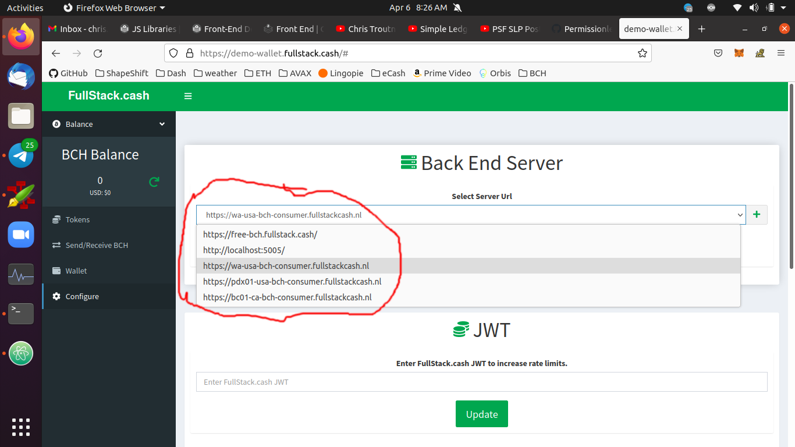

# Front End

The Cash Stack includes [Gatsby](https://www.gatsbyjs.com/) Starters, Themes, and Plugins for creating a web-based, non-custodial wallet. They include the [Capacitor](https://capacitorjs.com/) libraries to easily compile those apps into iOS and Android phone apps. The [Plugin structure](#gatsby-plugins) allows developers to quickly build and share extensions to the wallet app.

## Gatsby Starter
The fastest way for a business to launch its own white-labeled wallet app, is to fork [bch-wallet-starter](https://github.com/Permissionless-Software-Foundation/bch-wallet-starter). This will immediately give you an app that you can start customizing and hacking on. Out-of-the-box, it will have the same features as [demo-wallet.fullstack.cash](https://demo-wallet.fullstack.cash).

<iframe width="532" height="329" src="https://www.youtube.com/embed/G7ptg7VIRnk" title="YouTube video player" frameborder="0" allow="accelerometer; autoplay; clipboard-write; encrypted-media; gyroscope; picture-in-picture" allowfullscreen></iframe>

## Gatsby Theme
The Gatsby Starter is just a wrapper for the Gatsby Theme [gatsby-theme-bch-wallet](https://github.com/Permissionless-Software-Foundation/gatsby-theme-bch-wallet). If you need to hack on some of the lower-level features, forking the Theme might make more sense. Just like the Starter, the Theme includes [Capacitor](https://capacitorjs.com/) files for generating an Android or iOS app.

## Back End Service
The web wallet will need to connect to some back end wallet service. You can run that service yourself, or you can use wallet services provided by the PSF community. The wallet service is selected by navigating to the *Configure* tab.

No private information (keys, mnemonics, etc) is ever sent to the back end service. The service simply provides access to the blockchain and indexers, so the web wallet can query data and broadcast transactions.

The list of community-provided wallet services is dynamically loaded from [this Gist](https://gist.github.com/christroutner/63c5513782181f8b8ea3eb89f7cadeb6). To run your own wallet service, you'll need to install the [Local Back End](/docs/local-back-end).

## Gatsby Plugins

Developing new features are much easier to create by embedding them directly in to the Gatsby Starter. However, the easiest way to *share* these new features is to extract them into a Gatsby Plugin. This turns the feature into a self-contained 'lego block', which can easily be shared with other developers.

<iframe width="532" height="329" src="https://www.youtube.com/embed/NGnuwLJWqZ4" title="YouTube video player" frameborder="0" allow="accelerometer; autoplay; clipboard-write; encrypted-media; gyroscope; picture-in-picture" allowfullscreen></iframe>

Below are some of the most popular Plugins that have been developed for [bch-wallet-starter](https://github.com/Permissionless-Software-Foundation/bch-wallet-starter).

### TX Plugin
This is a very simple Plugin that is included by default into [bch-wallet-starter](https://github.com/Permissionless-Software-Foundation/bch-wallet-starter). It's included to illustrate the basic principles of how Plugins work and how a developer would go about creating one or including them in their Gatsby app. This plugin simply retrieves and displays the transaction history for an address.

- [gatsby-plugin-bch-tx-history](https://github.com/Permissionless-Software-Foundation/gatsby-plugin-bch-tx-history)

### Sweep Plugin
'Sweeping' is the act of scanning a [paper wallet](https://paperwallet.fullstack.cash) in order to move the cryptocurrency from the paper wallet to the wallet app. This plugin is used by [wallet.fullstack.cash](https://bchn-wallet.fullstack.cash). It supports both BCH and SLP token sweeping.

- [gatsby-plugin-bch-sweep](https://github.com/Permissionless-Software-Foundation/gatsby-plugin-bch-sweep)

### Sign Plugin
Cryptographically signing a message has a wide range of applications. This plugin allows the web wallet to be able to sign any given string of text.

- [gatsby-plugin-bch-sign](https://github.com/Permissionless-Software-Foundation/gatsby-plugin-bch-sign)

### Post Office
When SLP tokens are sent from one user to another, it requires some BCH to pay the transaction fees. This presents an on-boarding problem: if a new user receives tokens, but no BCH, their tokens are effectively 'stuck' until they acquire enough BCH to pay the transaction fee. The solution to this problem is the SLP Post Office. This concept is best explained [in this video](https://youtu.be/IATkQEdRdVI), and [a second video demonstrating this plugin](https://youtu.be/vtv9bAQx5LE). This plugin enables the web wallet to work with the [Post Office Server](https://github.com/Permissionless-Software-Foundation/simpleledger-post-office-server).

- [bch-wallet-plugin-postoffice](https://github.com/Permissionless-Software-Foundation/bch-wallet-plugin-postoffice)

## minimal-slp-wallet

[minimal-slp-wallet](https://www.npmjs.com/package/minimal-slp-wallet) is a JavaScript library compiled for use in a front end browser app. It provides basic wallet functionality for working with BCH and SLP tokens. It can be configured to operate on either the Web 2 or Web 3 architecture. It also has an instance of [bch-js](https://bchjs.fullstack.cash/) embedded into the library.

[minimal-avax-wallet](https://www.npmjs.com/package/minimal-avax-wallet) possesses the same functionality and interfaces, but operates on the Avalanche X-Chain blockchain.
