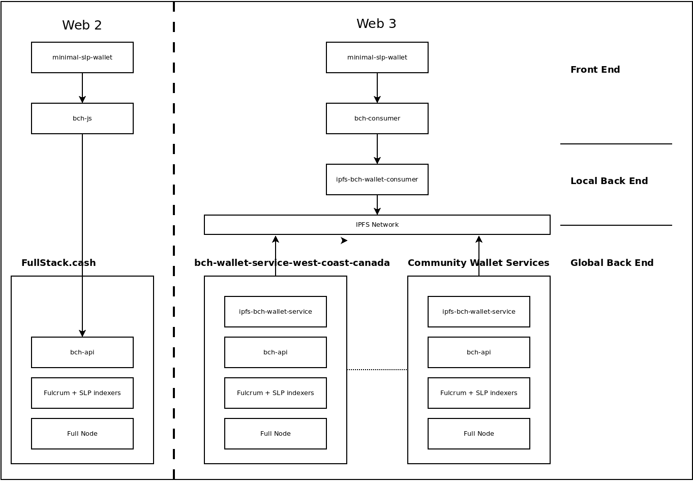

# Global Back End

The 'global' back end concept applies to both the Web 2 and Web 3 paradigms. In the Web 2 architecture, a front end library like [minimal-slp-wallet](https://www.npmjs.com/package/minimal-slp-wallet) or [bch-js](https://www.npmjs.com/package/@psf/bch-js) would connect directly to the Web 2 back end via [bch-api](https://github.com/Permissionless-Software-Foundation/bch-api).

In the Web 3 architecture, the same thing happens, but [bch-consumer](https://www.npmjs.com/package/bch-consumer) connects first to the [local back end](local-back-end). [ipfs-bch-wallet-service](https://github.com/Permissionless-Software-Foundation/ipfs-bch-wallet-service) (the local back end) then proxies the data from IPFS to [bch-api](https://github.com/Permissionless-Software-Foundation/bch-api).

Both architectures ultimately talk to `bch-api`, and the lower end of the stack is the same for both. The primary difference between the two back end architectures is scale. In Web 2, the back end is centralized and uses both horizontal and vertical cloud scaling (expensive). In Web 3, the global back end is decentralized. Web 3 stacks either operate alone and self-sufficiently, or they rely on a community of [incentivized](https://github.com/Permissionless-Software-Foundation/bounties) operators to donate their resources.

Comparing Web 2 vs Web 3 Back End Architectures

## Installation

The back end services all run inside Docker containers. Links to the docker containers (as well as pre-synced databases) can be downloaded from the [CashStrap page](https://fullstack.cash/cashstrap). The pre-synced databases make it much faster to set up your own infrastructure. Walk-through videos on installing the entire back end are available in the *Dev Ops & Infrastructure* section of the [PSF Videos page](https://psfoundation.cash/video/).

## bch-api

[bch-api](https://github.com/Permissionless-Software-Foundation/bch-api) is a REST API server based on [node.js](https://nodejs.org/en/) and the [Express.js](https://expressjs.com/) framework. It abstracts the full node and indexer layers into [a single, common REST interface](https://api.fullstack.cash/docs/). This means front-end developers do not need to know any of the specifics of operating a full node or the indexers. They can interface with those services by studying the REST API documentation.

## Fulcrum
[Fulcrum](https://github.com/Permissionless-Software-Foundation/docker-fulcrum) is the most performant indexer available for BTC, BCH, and eCash (BCHA) blockchains. It implements the Electrumx protocol used by [Electron Cash wallet](https://electroncash.org/). This indexer provides UTXO, address balance, and transaction history needed by any wallet app.

## psf-slp-indexer
The [psf-slp-indexer](https://github.com/Permissionless-Software-Foundation/psf-slp-indexer) crawls the blockchain data and tracks tokens that follow the [SLP specification for tokens](https://github.com/simpleledger/slp-specifications/blob/master/slp-token-type-1.md). This includes both fungible and non-fungible tokens (NFTs).

## ipfs-bch-wallet-service
[ipfs-bch-wallet-service](https://github.com/Permissionless-Software-Foundation/ipfs-bch-wallet-service) is the mirror image to [ipfs-bch-wallet-consumer](https://github.com/Permissionless-Software-Foundation/ipfs-bch-wallet-consumer). Together they bridge the IPFS network to pass transaction and blockchain data, in order to bridge the front and back ends of an application. This IPFS bridge is the main difference between the Web 2 and Web 3 architectures.
