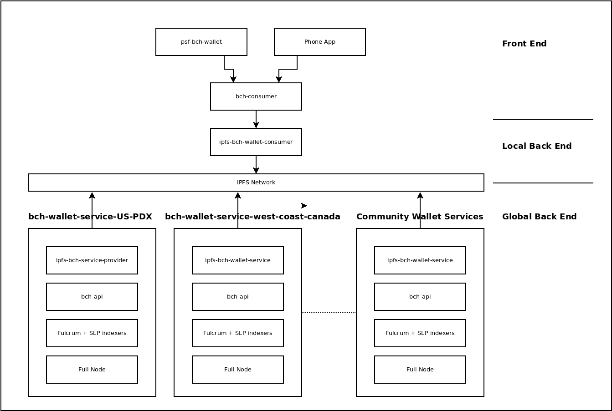

# Local Back End

The concept of a 'local' back end does not apply to the web 2 paradigm. It's a new concept that only applies in the realm of web 3.

As illustrated in the [introduction](intro), web 2 architecture has a centralized back end which the front end interacts with directly. In our web3 architecture, apps connect to a light-weight 'local' back end, which then proxies the communication over [IPFS](https://ipfs.io) to a 'global' back end.

**The main advantages of the web 3 architecture is reducing cost and improving censorship resistance.**

## ipfs-bch-wallet-consumer

The core piece of software making up the local back end is [ipfs-bch-wallet-consumer](https://github.com/Permissionless-Software-Foundation/ipfs-bch-wallet-consumer). This app provides a [REST API](https://free-bch.fullstack.cash/#api-REST_BCH) interface for front end apps to query data about the blockchain (and broadcast transactions).

`ipfs-bch-wallet-consumer` is configured to connect to one-of-many global back end services. This connection can change on-the-fly during operation in order to optimize performance. `ipfs-bch-wallet-consumer` connects to its mirror-image on the global back end: [ips-bch-wallet-service](https://github.com/Permissionless-Software-Foundation/ipfs-bch-wallet-service). This connection happens by passing end-to-end encrypted (e2ee) messages over the [IPFS](https://ipfs.io) network, via a [Circuit Relay](/docs/local-back-end/circuit-relay).

A dependency graph, showing how front end apps connect to Web 3 back end services.

## bch-consumer

Front end apps can connect directly to `ipfs-bch-wallet-consumer` via its [REST API](https://free-bch.fullstack.cash/#api-REST_BCH). This is the best option for non-JavaScript applications. But JavaScript applications can leverage the [bch-consumer npm library](https://www.npmjs.com/package/bch-consumer).

`bch-consumer` is a JavaScript library which provides an easy interface for interacting with `ipfs-bch-wallet-consumer`. It was inspired by the older [bch-js](https://www.npmjs.com/package/@psf/bch-js) JavaScript library, which has similar functionality for the older web 2 architecture.

## psf-bch-wallet

[psf-bch-wallet](https://github.com/Permissionless-Software-Foundation/psf-bch-wallet) is a command-line interface (CLI) application. It is the 'power tool' for Cash Stack developers. `psf-bch-wallet` is...

- A wallet for managing cryptocurrency and tokens.
- A rapid prototyping tool for trying out new ideas.
- An app for controlling and configuring `ipfs-bch-wallet-consumer`.
- A diagnostic tool for debugging network issues.
- A encrypted message app.
- An interface to the pay-to-write database ([P2WDB](https://github.com/Permissionless-Software-Foundation/ipfs-p2wdb-service)).

### Wallets and Rapid Prototyping

The obvious use of `psf-bch-wallet` is to manage wallets containing BCH and SLP tokens. The CLI app contains all the features available in [wallet.fullstack.cash](https://bchn-wallet.fullstack.cash), plus many additional features. Because there is no cumbersome user interface to deal with, it's much faster for JavaScript developers to hack on the CLI wallet and rapidly prototype new ideas.

### Controlling ipfs-bch-wallet-consumer

`psf-bch-wallet` is the primary way for issuing commands and controlling the network behavior of `ipfs-bch-wallet-consumer`. The `wallet-service` command will list all the global back ends that `ipfs-bch-wallet-consumer` can see on the network. The same command with a `-s` flag can instruct `ipfs-bch-wallet-consumer` to connect to a different global back end. Once connected, the `wallet-service-test` command will run diagnostic tests to ensure the global back end is fully functional and responsive.

By default, `psf-bch-wallet` connects to [free-bch.fullstack.cash](https://free-bch.fullstack.cash), which is a publically available instance of `ipfs-bch-wallet-consumer`, but its uptime is not guaranteed. The `conf` command is used to switch to a local instance of `ipfs-bch-wallet-consumer`. Here is an example for switching to a local instance of `ipfs-bch-wallet-consumer` running on port 5005:

- `./bin/run conf -k restServer -v http://localhost:5005`

### Network Diagnostics

The different `ipfs-*` commands are used for running diagnostics on the IPFS network. These commands are used to interrogate the IPFS node connected to `ipfs-bch-wallet-consumer`. You can list all the connected IPFS peers, and get information on connected [Circuit Relays](https://docs.libp2p.io/concepts/circuit-relay/). Circuit Relays are a critical element in networking and censorship resistance.

### Encrypted Messaging

`psf-bch-wallet` can send encrypted messages to any other `bitcoincash:` address. It can also decrypt and display any encrypted messages sent to your wallet. These messages are end-to-end encrypted (e2ee) using the same eliptic-curve encryption used to make Bitcoin payments.

### Pay-to-Write Database

The pay-to-write database ([P2WDB](https://github.com/Permissionless-Software-Foundation/ipfs-p2wdb-service)) is a censorship-resistant database. It's similar in many ways to a blockchain, but better optimized for storing data. `psf-bch-wallet` can read and write data to the P2WDB. Raw data can be reviewed at [explorer.fullstack.cash](https://explorer.fullstack.cash).
